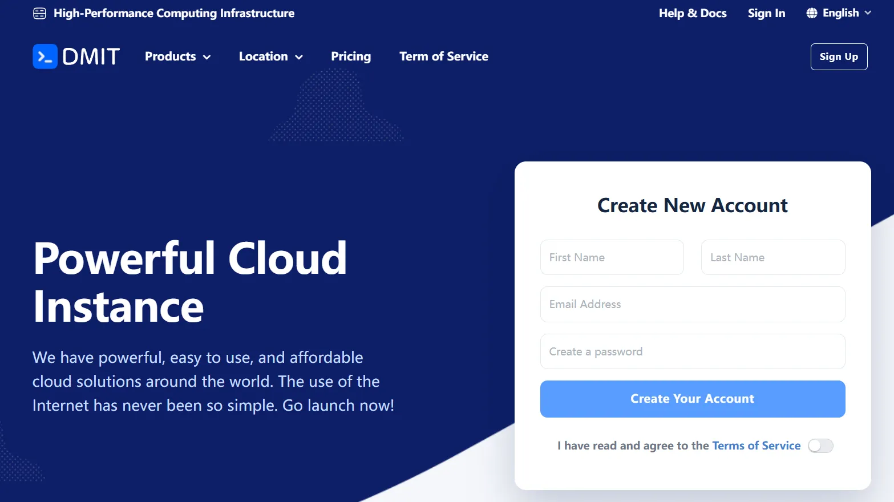

# DMIT 评测与使用指南

> 本仓库对应网站：**[dmitguide.github.io](https://dmitguide.github.io)** — 提供最新的 DMIT VPS 套餐评测与购买教程。

---

## DMIT 是什么？

DMIT 是一家成立于 2017 年、总部位于美国洛杉矶的高端 VPS 服务商，专注于为中国大陆及亚太地区用户提供**优质直连回国网络**的云服务器产品。

[点击这里前往 DMIT 官网](https://www.dmit.io/aff.php?aff=23702) 

DMIT 的核心竞争优势在于其独特的网络资源储备：旗下服务器接入电信 **CN2 GIA**（AS4809）、联通 **AS9929**、移动 **CMIN2** 等顶级优化线路，在晚高峰时段依然能够保持极低的延迟和极高的稳定性，这是大多数同价位竞品难以企及的。

**DMIT 主要数据中心节点：**

| 地区 | 机房代码 | 核心卖点 |
|------|---------|---------|
| 🇺🇸 美国洛杉矶 | LAX | 电信 CN2 GIA + 联通 AS9929，综合最优 |
| 🇯🇵 日本东京 | TYO | 极低延迟直连中国，北方用户首选 |
| 🇭🇰 中国香港 | HKG | 零跳数连接中国大陆，南方用户首选 |

---

## 产品线说明

DMIT 目前主要提供以下四大产品线，各有侧重：

| 产品线 | 线路 | 定位 | 适合场景 |
|--------|------|------|---------|
| **Premium** | CN2 GIA / AS9929 | 顶级回国直连 | 核心生产环境、低延迟要求、跨境业务 |
| **Eyeball** | 优质混合路由 / CMIN2 等 | 高端优化线路 | 兼顾高性能与大带宽、高质量建站、API服务 |
| **Tier1** | 国际骨干网络 (BGP) | 高性价比大带宽 | 大流量出海、面向纯海外用户的服务、个人开发测试 |

---

## 热门套餐一览

以下为截至 2026 年 7 月各系列代表性套餐，价格单位为美元/月：

### 🔥 洛杉矶 Premium 系列（顶级直连）

| 套餐名称 | CPU | 内存 | SSD | 流量 | 端口 | 月价 | 直达链接 |
|---------|-----|------|-----|------|------|------|---------|
| LAX.Premium.AS3.TINY | 1 核 | 2 GB | 20 GB | 1000 GB | 1 Gbps | $10.90 | [立即购买](https://www.dmit.io/aff.php?aff=23702&pid=253) |
| LAX.Premium.AS3.Pocket | 2 核 | 2 GB | 40 GB | 1500 GB | 4 Gbps | $16.90 | [立即购买](https://www.dmit.io/aff.php?aff=23702&pid=254) |
| LAX.Premium.AS3.STARTER | 2 核 | 2 GB | 80 GB | 3000 GB | 10 Gbps | $34.90 | [立即购买](https://www.dmit.io/aff.php?aff=23702&pid=255) |
| LAX.Premium.AS3.MINI | 4 核 | 4 GB | 80 GB | 5000 GB | 10 Gbps | $62.90 | [立即购买](https://www.dmit.io/aff.php?aff=23702&pid=256) |
| LAX.Premium.AS3.MICRO | 4 核 | 4 GB | 160 GB | 7000 GB | 10 Gbps | $87.90 | [立即购买](https://www.dmit.io/aff.php?aff=23702&pid=257) |
| LAX.Premium.AS3.MEDIUM | 6 核 | 8 GB | 160 GB | 15000 GB | 10 Gbps | $199.90 | [立即购买](https://www.dmit.io/aff.php?aff=23702&pid=258) |

### 🚀 洛杉矶 Eyeball 系列（高端优化）

| 套餐名称 | CPU | 内存 | SSD | 流量 | 端口 | 月价 | 直达链接 |
|---------|-----|------|-----|------|------|------|---------|
| LAX.Eyeball.AS3.TINY | 1 核 | 2 GB | 20 GB | 1500 GB | 2 Gbps | $10.90 | [立即购买](https://www.dmit.io/aff.php?aff=23702&pid=259) |
| LAX.Eyeball.AS3.Pocket | 2 核 | 2 GB | 40 GB | 3000 GB | 4 Gbps | $16.90 | [立即购买](https://www.dmit.io/aff.php?aff=23702&pid=260) |
| LAX.Eyeball.AS3.STARTER | 2 核 | 2 GB | 80 GB | 5000 GB | 10 Gbps | $34.90 | [立即购买](https://www.dmit.io/aff.php?aff=23702&pid=261) |
| LAX.Eyeball.AS3.MINI | 4 核 | 4 GB | 80 GB | 10000 GB | 10 Gbps | $62.90 | [立即购买](https://www.dmit.io/aff.php?aff=23702&pid=262) |
| LAX.Eyeball.AS3.MICRO | 4 核 | 4 GB | 160 GB | 14000 GB | 10 Gbps | $87.90 | [立即购买](https://www.dmit.io/aff.php?aff=23702&pid=263) |
| LAX.Eyeball.AS3.MEDIUM | 6 核 | 8 GB | 160 GB | 30000 GB | 10 Gbps | $199.90 | [立即购买](https://www.dmit.io/aff.php?aff=23702&pid=264) |

> 💡 **选购技巧**：
> - **Premium 系列**：回国网络极致优化，晚高峰依然坚挺，适合核心生产环境和对延迟极其敏感的业务。
> - **Eyeball 系列**：高端混合路由线路，兼顾了优质回国网络与大带宽，是性能与流量的完美平衡。
> - **Tier1 系列**：主打国际互联，不含专属回国优化，因此性价比最高，适合流量极大或纯面向海外的业务。

---

## 为什么选择 DMIT？

### ✅ 顶级回国线路
DMIT 是国内少数能稳定提供 **电信 CN2 GIA + 联通 AS9929** 双优化线路的服务商，晚高峰丢包率接近零，延迟极度稳定。

### ✅ 高端硬件底座
大部分 VPS 基于 **AMD EPYC（霄龙）** 服务器级处理器，搭配企业级 **NVMe SSD**，I/O 性能远超传统 SATA SSD。

### ✅ 国内支付无障碍
完美支持 **支付宝（Alipay）** 和 **微信支付（WeChat Pay）**，国内用户无需信用卡，扫码即可完成购买。

### ✅ 弹性配置，按需选择
从入门级 $10.90/月的 TINY 套餐，到企业级千美元套餐，覆盖个人开发者到中大型企业的全场景需求。

---

## 📚 更多内容，请访问我的网站

本 GitHub 仓库是 **[dmitguide.github.io](https://dmitguide.github.io)** 的源码仓库，网站内包含：

- 📖 **[DMIT VPS 完整购买教程](https://dmitguide.github.io/posts/how-to-buy-and-use-dmit)** — 从注册到 SSH 登录全流程图文详解
- 🛒 **[最新套餐与产品速查](https://dmitguide.github.io)** — 实时同步的 DMIT 官方产品数据

> ⭐ 如果本项目对你有帮助，欢迎点击右上角 **Star** 支持！

---

## 免责声明

本站与 DMIT 存在 Affiliate 合作伙伴关系。通过本页链接购买 DMIT 产品时，本站可能获得一定比例的佣金，**这不会增加您的任何购买费用**。所有内容基于真实使用体验，独立客观。

---

*最后更新：2026 年 7 月*
